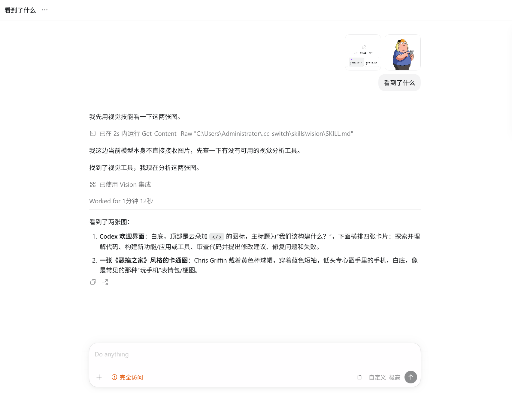
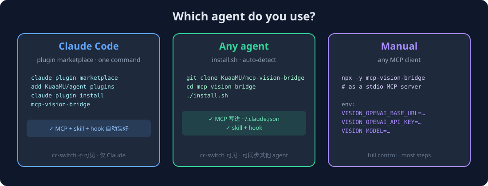
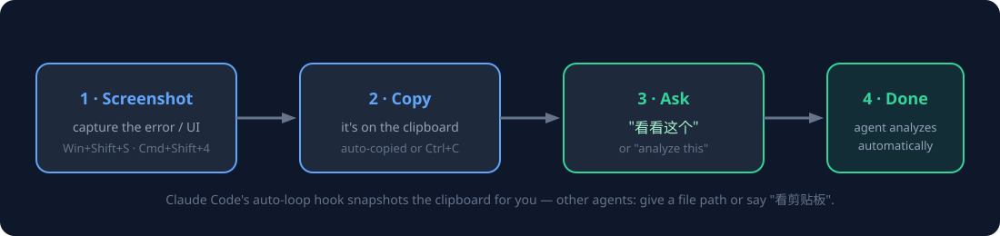
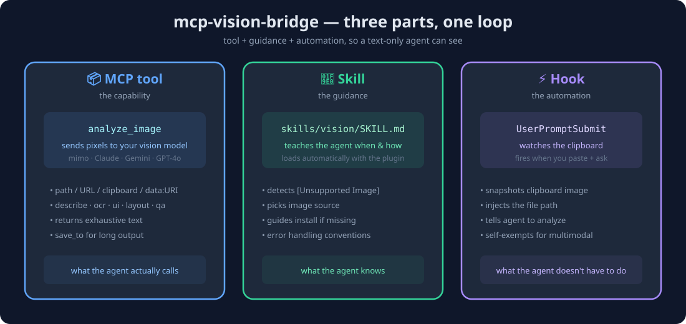
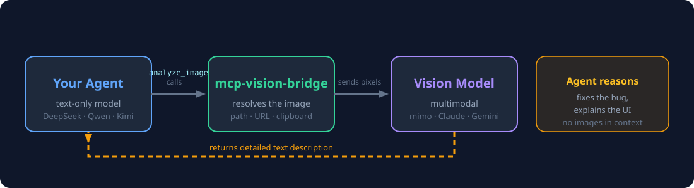

<div align="center">

# 👁️ mcp-vision-bridge

**Give your text-only coding agent eyes.**

DeepSeek V4 Flash writes great code — but it can't *see* the error dialog, the broken UI, or the screenshot you just pasted. This MCP server gives any text-only agent vision by routing images through a multimodal model of your choice.

Works with **Claude Code · Codex · opencode · Kimi · PI · Cursor** and any MCP client.

[English](README.md) · [中文](README-CN.md)



</div>

---

## Why you need this

Your agent can't see. You paste a screenshot → *"I can't see images."* You
transcribe the error by hand. With this, the agent calls one tool and gets a
complete text description — verbatim text, layout, colors, anomalies — and can
debug, fix, and explain.

> **Not a vision model.** It's a bridge: it sends your image to a multimodal
> model you already pay for (mimo, Claude, Gemini, GPT-4o, Qwen-VL…) and returns
> a detailed description. No images ever enter your agent's context.

---

## 🚀 Install (pick your agent — that's the whole setup)



### Claude Code (one command)

```bash
claude plugin marketplace add KuaaMU/agent-plugins
claude plugin install mcp-vision-bridge
```

That's it — the plugin bundles the **MCP server + vision skill + auto-loop hook**. Claude Code will prompt you for your vision endpoint, API key, and model once.

> Prefer to manage it in **cc-switch** (see it + sync to Codex/opencode/Gemini)? Use the installer below instead.

### Codex / Reasonix / opencode / Kimi / anything else (one command)

```bash
git clone https://github.com/KuaaMU/mcp-vision-bridge && cd mcp-vision-bridge
./install.sh                     # auto-detects your agent
```

`./install.sh claude | reasonix | codex | opencode | kimi` if it doesn't auto-detect. You'll be asked for three values: **endpoint**, **key**, **model**.

**Reasonix** reads the same `.mcp.json` as Claude Code, so `./install.sh reasonix`
(or a manual `.mcp.json` with the `vision` server) works — pasted images land in
`.reasonix/attachments/` and `image="recent"` finds them.

### Manual (no install script)

Add this as a stdio MCP server in your agent:

```json
{
  "command": "npx",
  "args": ["-y", "mcp-vision-bridge"],
  "env": {
    "VISION_OPENAI_BASE_URL": "https://your-endpoint/v1",
    "VISION_OPENAI_API_KEY": "sk-your-key",
    "VISION_MODEL": "your-vision-model"
  }
}
```

Requires **Node.js ≥ 18**.

---

## 🎯 Use

After install, **restart your agent**, then:



**Best way — drag the image file into the chat.** Dragging an image file into
any agent (TUI or GUI) inserts its real path, which `analyze_image` accepts
directly — works identically in Claude Code, Cowork, Codex, opencode, PI, and
more. No clipboard, no paste quirks.

1. **Drag an image file into the input box** (or Ctrl+V in Claude Code / Cowork)
2. Say **"看看这个"** (or "analyze this", "what's the error?")
3. Your agent calls `analyze_image` → the vision model describes it in detail

Paste 3 images? The hook reads your session transcript (lossless, multi-image).
`image="recent"` auto-finds pasted images across **Claude Code CLI, Reasonix,
Cowork, and Codex** — no clipboard needed. If a desktop GUI doesn't register a
paste (it can fail silently), just **drag the file in** — a path always works.

### The one tool

> Agent docs → [**README_AGENT.md**](README_AGENT.md) (tool contract, source choice, error handling).

```
analyze_image(
  image   = "path | URL | clipboard | recent | session | data:URI",  // single, or
             ["path","path",...]                                      // several in one call
  task    = "describe | ocr | ui | layout | qa",   // or use prompt:
  prompt  = "What error is on screen?",
  detail  = "high" | "low",
  save_to = "optional file for long output"
)
```

- **`image`** — local path, http(s) URL, `"clipboard"`, `"recent"` (most recent
  pasted image **in this session**), `"session"` (**every image pasted in this
  session, analyzed in one call**), a base64 data URI, or an **array** of these
  to analyze multiple images at once (e.g. "compare these two").
- **`task`** — common jobs; `ocr` extracts text, `ui` specs a screen, etc.
- **`prompt`** — free-form question (overrides `task`). **Pass the user's actual
  question here** — the vision model answers what you ask, so a specific question
  ("what error is shown?") beats a generic `describe`.

### How pasted images are discovered

Pasting an image into a coding agent stores it somewhere. `image="recent"` /
`"session"` find it automatically — no clipboard, no manual paths:

| Agent | Where pasted images land | Auto-found? |
|---|---|---|
| Claude Code CLI/TUI | `~/.claude/image-cache/<uuid>/N.png` (paste with **Alt+V**) | ✅ |
| Reasonix | `~/.reasonix/sessions/` + project `.reasonix/attachments/` | ✅ |
| opencode | `~/.local/share/opencode/opencode.db` (SQLite `part` table, Node ≥ 22.5) | ✅ |
| Cowork (Claude-3p desktop) | `%LOCALAPPDATA%\Claude-3p\...\uploads\*_image.png` | ✅ |
| Codex | `~/.codex/attachments/<session>/image-*.png` | ✅ |
| Grok Build | `~/.grok/sessions/*/*/images/` | ✅ |

> **Windows clipboard reality:** in Explorer, "copy file" (Ctrl+C) puts a *file
> list* on the clipboard — not image bytes. So pasting a local image into a CLI
> only works if you copy the image *content* (screenshot tool, browser "copy
> image"). Otherwise just paste the file path — `analyze_image` reads it directly.

---

## Demo (mimo-v2.5)

`analyze_image` → describe/ocr → detailed text. The same tool works with any vision model.

**Real usage in Codex GUI** (above): two images pasted, the agent correctly
identifies both — the Codex welcome screen and a Chris Griffin illustration.
Auto-discovery found them in `~/.codex/attachments/`; no path was typed.

**OCR a screenshot** → every line reproduced verbatim, including the menu bar
`文件(F) 编辑(E) 格式(O) 查看(V) 帮助(H)` and the whole body, in reading order.

**Describe a diagram** → elements, spatial layout, colors, and any anomaly, enumerated.

---

## Architecture



Three parts that close the loop for a text-only agent:

- **MCP tool** (`analyze_image`) — the capability. Sends pixels to your vision model, returns text.
- **Skill** (`skills/vision/`) — the guidance. Tells the agent *when* and *how* to call it.
- **Hook** (`UserPromptSubmit`) — the automation. Captures a pasted image from the session transcript and triggers the call for you.

Install them all with the plugin (Claude Code) or `install.sh` (any agent).

---

## How it works



Pure text in, pure text out. The server never interprets the image — it fetches
the bytes and lets your vision model do the seeing.

---

## Configuration

All via environment variables (the MCP reads them from your agent's server config).

| Variable | When | Example |
|---|---|---|
| `VISION_OPENAI_BASE_URL` | OpenAI-compatible | `https://opencode.ai/zen/go/v1` |
| `VISION_OPENAI_API_KEY` | OpenAI-compatible | `sk-...` |
| `VISION_MODEL` | always | `mimo-v2.5`, `gpt-4o`, `qwen-vl-max` |
| `VISION_PROVIDER` | non-openai | `anthropic` \| `gemini` |
| `VISION_ANTHROPIC_API_KEY` | anthropic | `sk-ant-...` |
| `VISION_GEMINI_API_KEY` | gemini | `AIza...` |
| `VISION_MAX_TOKENS` | optional | `2048` per image — **auto-scaled ×N for N images** (capped 12000) so multi-image descriptions aren't truncated |
| `VISION_TIMEOUT_MS` | optional | `30000` |
| `VISION_BLOCK_PRIVATE_URLS` | optional | `true` to block localhost fetches |

---

## Development

```bash
npm install
npm run build          # tsc → dist/
npm test               # vitest
npm run test:e2e       # stdio pipeline against a mock provider
```

Layout: `src/` (server), `skills/vision/` (skill), `hooks/` (auto-loop hook),
`install.sh` (installer), `examples/` (per-agent templates).

---

## Security

- Keys live in env/config only — never in tool arguments.
- Optional SSRF guard for URL sources.
- Images go only to your configured vision provider.

## License

[MIT](LICENSE)

---

<div align="center">

**DeepSeek writes the code. `mcp-vision-bridge` reads the screen.**

[GitHub](https://github.com/KuaaMU/mcp-vision-bridge) · [npm](https://www.npmjs.com/package/mcp-vision-bridge) · [Plugins](https://github.com/KuaaMU/agent-plugins) · ⭐ Star it if it's useful

</div>
